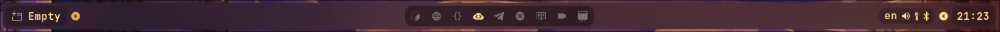
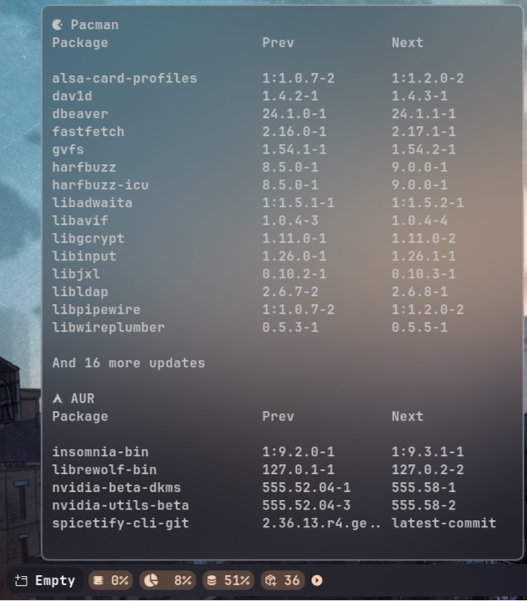
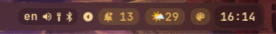
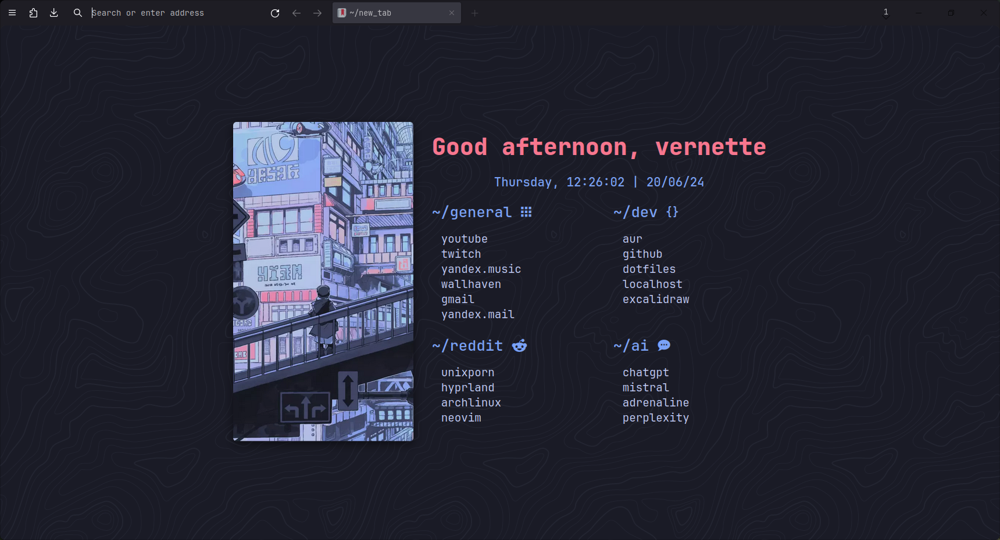
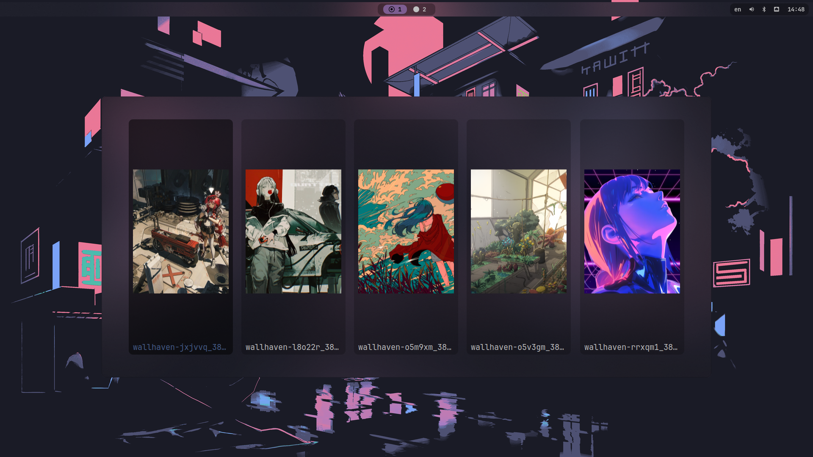

# Hyprsnap


> [!NOTE]
> Please keep in mind that this is my daily driver. Use my config files as a reference.

- [Used software](#used-software)
- [Screenshots](#screenshots)
- [Dependencies](#dependencies)
- [Installation](#installation)
- [TODO](#todo)

## Used software

### Base

| Type               | Name                                                |
| ------------------ | --------------------------------------------------- |
| OS                 | [Arch Linux](https://archlinux.org/)                |
| Window Compositor  | [Hyprland](https://hyprland.org/)                   |
| Bar                | [Waybar](https://github.com/Alexays/Waybar)         |
| Terminal           | [kitty](https://github.com/kovidgoyal/kitty)        |
| Shell              | zsh                                                 |
| ZSH Plugin Manager | [zinit](https://github.com/zdharma-continuum/zinit) |
| ZSH Prompt         | [starship](https://github.com/starship/starship)    |

### UI

| Type            | Name                                                                    |
| --------------- | ----------------------------------------------------------------------- |
| GTK Theme       | [adw-gtk3](https://github.com/lassekongo83/adw-gtk3)                    |
| Rofi Icon Theme | [la-capitaine](https://github.com/keeferrourke/la-capitaine-icon-theme) |
| GTK Icon Theme  | Adwaita                                                                 |
| Main Font       | [JetBrainsMono Nerd Font](https://www.nerdfonts.com/font-downloads)     |
| Emoji Font      | [Noto Emoji](https://github.com/googlefonts/noto-emoji)                 |
| Colorscheme     | [pywal16](https://github.com/eylles/pywal16)                            |

### Other

| Type                               | Name                                                                                 |
| ---------------------------------- | ------------------------------------------------------------------------------------ |
| Browser                            | [Librewolf](https://librewolf.net/)                                                  |
| Browser Startpage                  | [startpage](https://gitlab.com/fazzi/startpage) by fazzi                             |
| Browser CSS                        | [FirefoxCSS](https://github.com/Bali10050/FirefoxCSS) by Bali10050                   |
| Text Editor                        | [Neovim](https://neovim.io/)                                                         |
| Terminal File Manager              | [lf](https://github.com/gokcehan/lf)                                                 |
| GTK File Manager                   | Nautilus                                                                             |
| Wallpaper Daemon                   | [swww](https://github.com/LGFae/swww)                                                |
| Better ls                          | [lsd](https://github.com/lsd-rs/lsd)                                                 |
| Better cd                          | [zoxide](https://github.com/ajeetdsouza/zoxide)                                      |
| AUR Helper                         | [paru](https://github.com/Morganamilo/paru)                                          |
| App Launcher                       | [Rofi](https://github.com/davatorium/rofi)                                           |
| Screenshot Utility                 | [hyprshot](https://github.com/Gustash/Hyprshot)                                      |
| System Info                        | [fastfetch](https://github.com/fastfetch-cli/fastfetch)                              |
| Notification Daemon/Control Center | [Sway Notification Center](https://github.com/ErikReider/SwayNotificationCenter)     |
| Music Player                       | Spotify with [Spicetify](https://spicetify.app/)                                     |
| Audio Visualizers                  | [cava](https://github.com/karlstav/cava), [catnip](https://github.com/noriah/catnip) |
| Lockscreen App                     | [hyprlock](https://github.com/hyprwm/hyprlock)                                       |
| Idle Daemon                        | [hypridle](https://github.com/hyprwm/hypridle)                                       |
| Power Menu App                     | [wlogout](https://github.com/ArtsyMacaw/wlogout)                                     |
| WiFi Menu                          | [iwdrofimenu](https://github.com/defname/rofi-iwd-wifi-menu)                         |
| Bluetooth Manager                  | [Overskride](https://github.com/kaii-lb/overskride)                                  |
| Terminal Art                       | [rustmon](https://github.com/Vomitblood/rustmon)                                     |

### Pywal themes for applications

| Type                 | Name                                                                                          |
| -------------------- | --------------------------------------------------------------------------------------------- |
| Telegram Pywal Theme | [walogram](https://codeberg.org/thirtysixpw/walogram)                                         |
| VS Code Pywal Theme  | [Wal Theme](https://marketplace.visualstudio.com/items?itemName=dlasagno.wal-theme) Extension |

### Wallpapers

Check out my wallpapers [repository](https://github.com/vernette/wallpapers)

[Wallpaper](https://github.com/vernette/wallpapers/blob/main/53.png) used in screenshots

## Screenshots

<details>
    <summary>Workflow</summary>
    
    
    
    
</details>

<details>
    <summary>Waybar</summary>
    
    
    
</details>

<details>
    <summary>Librewolf</summary>
    
</details>

<details>
    <summary>Rofi</summary>
    
</details>

<details>
    <summary>Rofi wallpaper selector</summary>
    
</details>

<details>
    <summary>Spotify</summary>
    
    
    
</details>

<details>
    <summary>Neovim</summary>
    
</details>

<details>
    <summary>Telegram (AyuGram)</summary>
    
</details>

<details>
    <summary>wlogout</summary>
    
</details>

<details>
    <summary>hyprlock</summary>
    
    
</details>

<details>
    <summary>Sway Notification Center</summary>
    
</details>

## Dependencies

### Main repo

```bash
sudo pacman -S kitty ttf-jetbrains-mono-nerd noto-fonts-emoji lf grim slurp wl-clipboard hyprland waybar zsh playerctl lsd libnotify hyprlang hyprlock hypridle swaync neovim fastfetch
```

### AUR

```bash
paru -S ueberzugpp swww pywal-16-colors wlogout rofi-lbonn-wayland-git iwdrofimenu-git overskride spicetify-cli cava catnip adw-gtk3 walogram-git rustmon-git hyprshot
```

### ZSH specific

```bash
sudo pacman -S fzf zoxide starship pkgfile
```

### Waybar specific

```bash
paru -S wttrbar
```

### Neovim specific

```bash
sudo pacman -S ripgrep unzip npm
```

## Installation

Make sure to install stow:

```bash
sudo pacman -S stow
```

Clone repo into home folder and stow dotfiles:

```bash
git clone --depth 1 https://github.com/vernette/hyprsnap ~/.dotfiles
cd ~/.dotfiles
stow .
```

If you want stow to overwrite existing files, then add `--adopt` flag:

```bash
stow . --adopt
```

To get the `command-not-found` [plugin](https://github.com/ohmyzsh/ohmyzsh/tree/master/plugins/command-not-found) working, run this commands:

```bash
pkgfile -u
sudo systemctl enable --now pkgfile-update.timer # Enable automatic updates https://wiki.archlinux.org/title/Pkgfile#Automatic_updates
```

Also for `rustmon`:

```bash
rustmon fetch
```

## TODO

- [ ] Installation script
- [ ] Custom SDDM theme
- [x] Custom Librewolf CSS
- [x] Custom Librewolf startpage
