# Hyprsnap


- [Used software](#used-software)
- [Screenshots](#screenshots)
- [Dependencies](#dependencies)
- [Installation](#installation)

## Used software

### Base

| Type              | Name                                                                                           |
| ----------------- | ---------------------------------------------------------------------------------------------- |
| OS                | [Arch Linux](https://archlinux.org/)                                                           |
| Window Compositor | [Hyprland](https://hyprland.org/)                                                              |
| Terminal          | Alacritty [fork](https://github.com/GregTheMadMonk/alacritty-smooth-cursor) with smooth cursor |
| Shell             | zsh with [oh-my-zsh](https://ohmyz.sh/)                                                        |
| Colorscheme       | [pywal16](https://github.com/eylles/pywal16)                                                   |

### UI

| Type            | Name                                                                    |
| --------------- | ----------------------------------------------------------------------- |
| GTK Theme       | [adw-gtk3](https://github.com/lassekongo83/adw-gtk3)                    |
| Rofi Icon Theme | [la-capitaine](https://github.com/keeferrourke/la-capitaine-icon-theme) |
| GTK Icon Theme  | Adwaita                                                                 |
| Main Font       | [JetBrainsMono Nerd Font](https://www.nerdfonts.com/font-downloads)     |
| Emoji Font      | [Twitter Color Emoji](https://github.com/13rac1/twemoji-color-font)     |

### Other

| Type                               | Name                                                                             |
| ---------------------------------- | -------------------------------------------------------------------------------- |
| Browser                            | [Librewolf](https://librewolf.net/)                                              |
| Editor                             | [Neovim](https://neovim.io/)                                                     |
| Terminal File Manager              | [lf](https://github.com/gokcehan/lf)                                             |
| Wallpaper Daemon                   | [swww](https://github.com/LGFae/swww)                                            |
| GTK File Manager                   | Nautilus                                                                         |
| Icons for ls                       | [lsd](https://github.com/lsd-rs/lsd)                                             |
| AUR Wrapper                        | [paru](https://github.com/Morganamilo/paru)                                      |
| Bar                                | [Waybar](https://github.com/Alexays/Waybar)                                      |
| App Launcher                       | [Rofi](https://github.com/davatorium/rofi)                                       |
| Screenshot Utilities               | grim + slurp                                                                     |
| System Info                        | [macchina](https://github.com/Macchina-CLI/macchina)                             |
| Notification Daemon/Control Center | [Sway Notification Center](https://github.com/ErikReider/SwayNotificationCenter) |
| Music Player                       | Spotify with [Spicetify](https://spicetify.app/)                                 |
| Audio Visualizer                   | [cava](https://github.com/karlstav/cava)                                         |
| Lockscreen App                     | [hyprlock](https://github.com/hyprwm/hyprlock)                                   |
| Idle Daemon                        | [hypridle](https://github.com/hyprwm/hypridle)                                   |
| Power Menu App                     | [wlogout](https://github.com/ArtsyMacaw/wlogout)                                 |
| WiFi Menu                          | [iwdrofimenu](https://github.com/defname/rofi-iwd-wifi-menu)                     |
| Bluetooth Menu                     | [rofi-bluetooth](https://github.com/nickclyde/rofi-bluetooth)                    |
| Terminal Art                       | [arTTY](https://github.com/mjwhitta/artty)                                       |

### Pywal themes for Applications

| Type                               | Name                                                                             |
| ---------------------------------- | -------------------------------------------------------------------------------- |
| Telegram Pywal Theme               | [wal-telegram](https://github.com/guillaumeboehm/wal-telegram)                   |
| VS Code Pywal Theme                | [Wal Theme](https://marketplace.visualstudio.com/items?itemName=dlasagno.wal-theme) Extension                                             |

## Screenshots

### Workflow


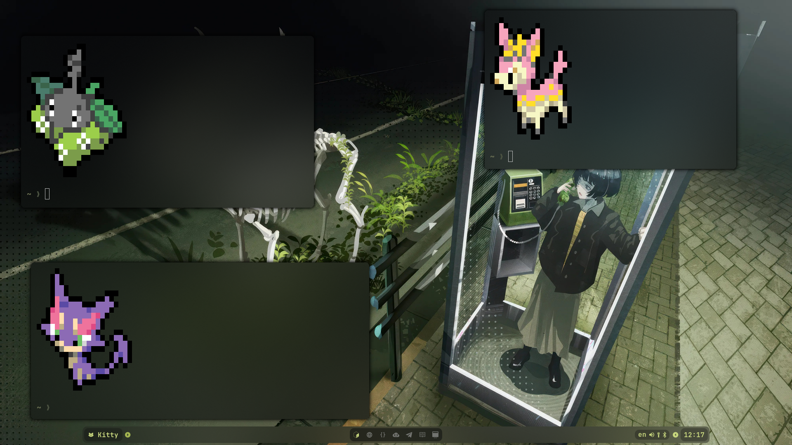
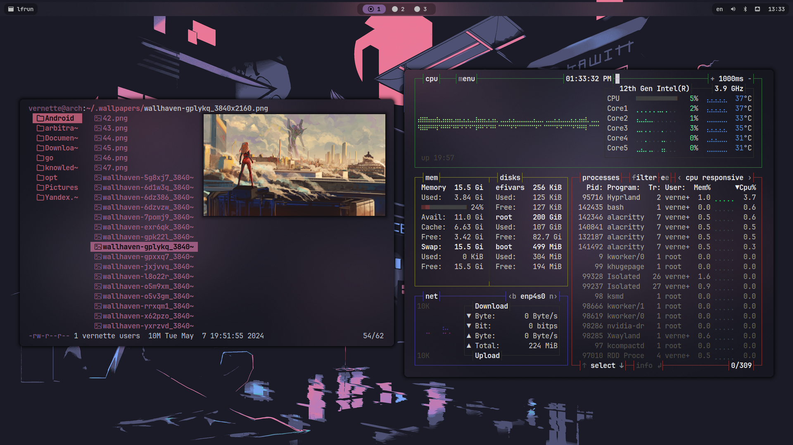
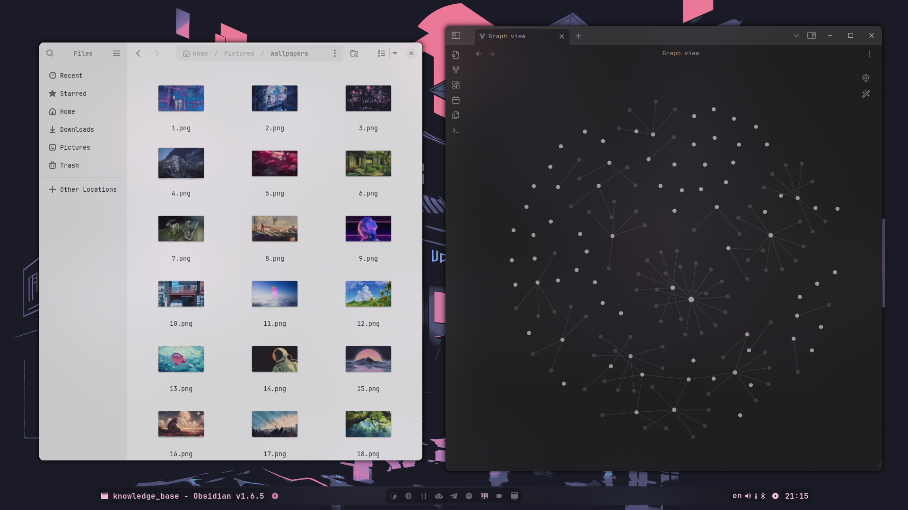

### Applications

#### Rofi

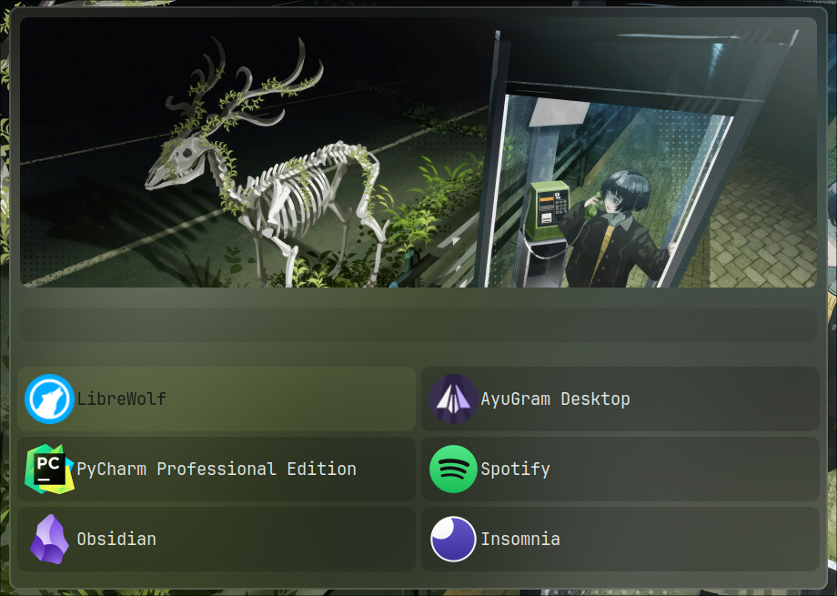

#### Spotify


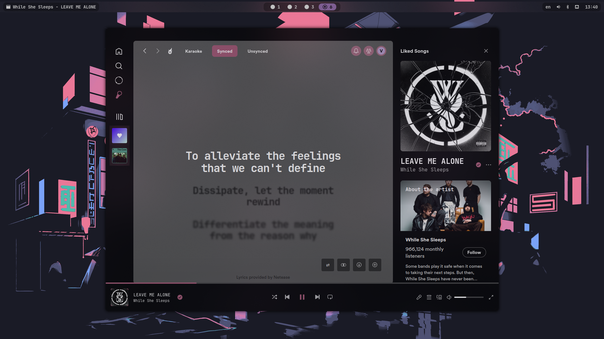
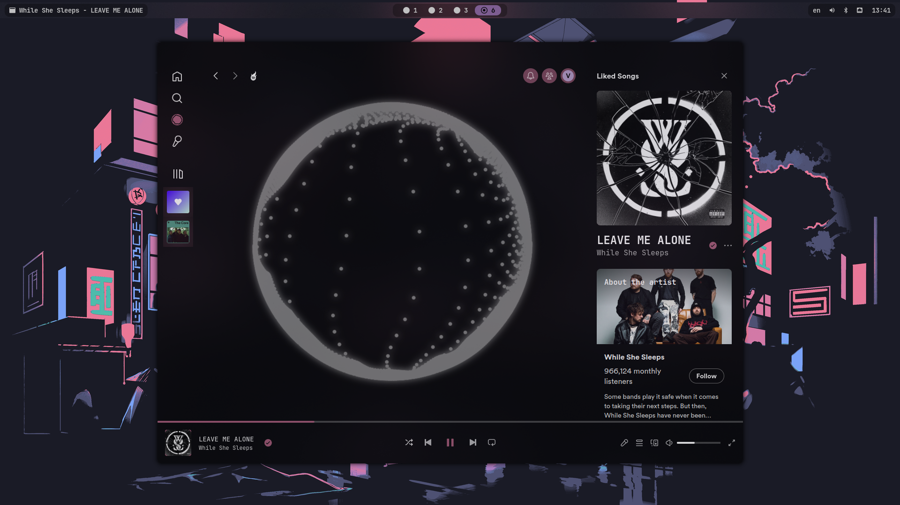

#### VS Code


#### Neovim

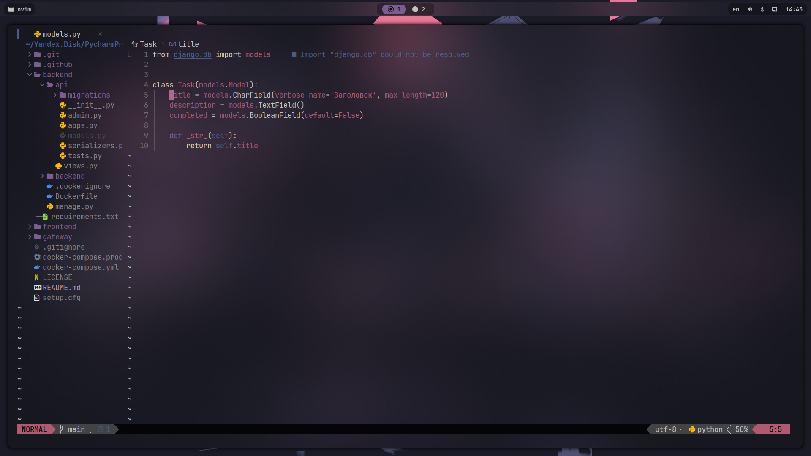

#### Telegram (AyuGram)


#### wlogout

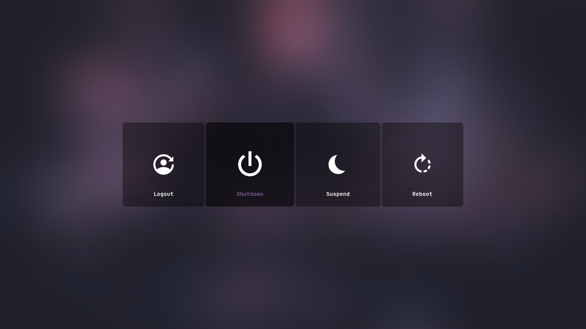

#### hyprlock

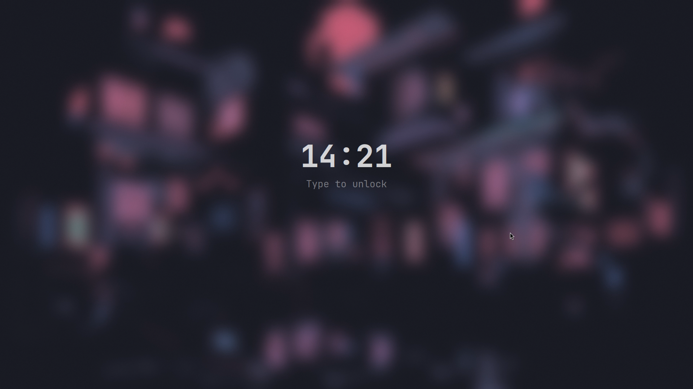
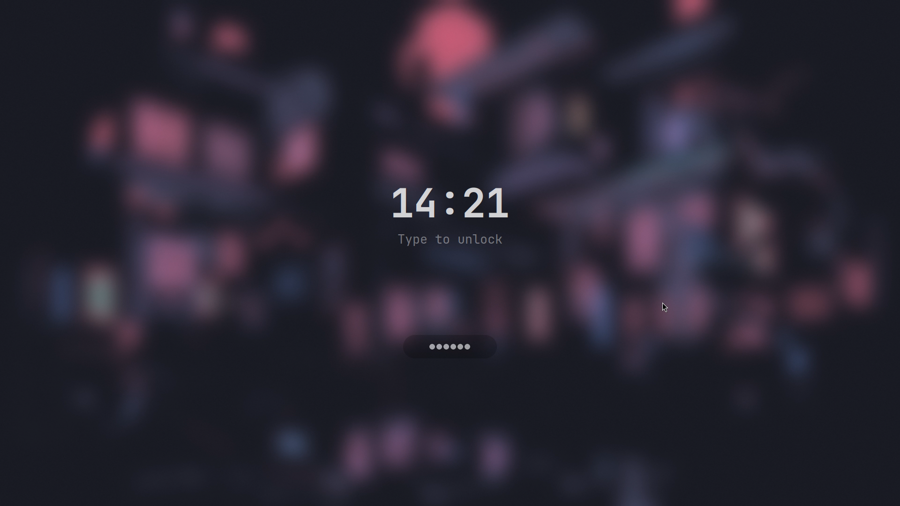

#### Sway Notification Center

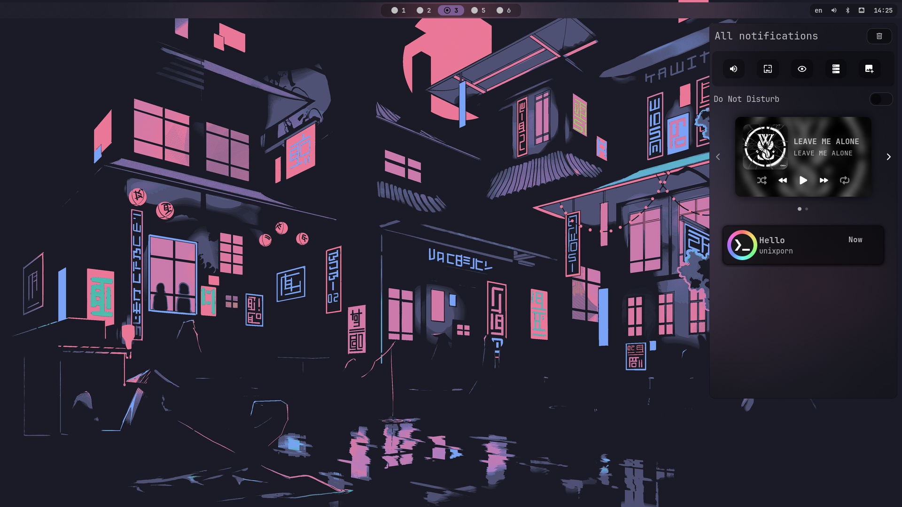

## Dependencies

### Main repo

```bash
sudo pacman -S ttf-jetbrains-mono-nerd lf grim slurp wl-clipboard hyprland waybar zsh playerctl lsd libnotify hyprlang hyprlock hypridle swaync neovim 
```

### AUR

```bash
paru -S alacritty-smooth-cursor-git ttf-twemoji-color ueberzugpp swww pywal-16-colors wlogout rofi-lbonn-wayland-git iwdrofimenu-git rofi-bluetooth-git spicetify-cli cava adw-gtk3
```
### Neovim specific

>[!Note]
> To install Neovim plugins correctly, you must have npm installed

```bash
sudo pacman -S npm ripgrep unzip
```

## Installation

Make sure to install stow:

```bash
sudo pacman -S stow
```

Clone repo into home folder and stow dotfiles:

```bash
git clone https://github.com/vernette/hyprsnap ~/.dotfiles
cd ~/.dotfiles
stow .
```
